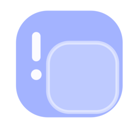
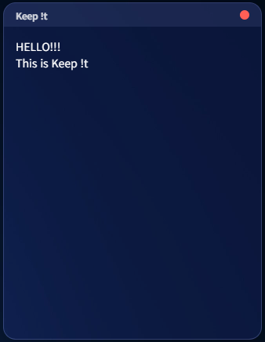

# Keep !t
A minimalist, glassmorphic semi-transparent notepad that anchors to the bottom-right corner of the Windows screen.

<p align="center">
    
  <!--  -->
</p>

<p align="center">
  
  
  
</p>

---

## Download
[-0078D4?style=for-the-badge&logo=windows&logoColor=white)](https://github.com/SquareBracket-GitHub/keep-it/releases/download/v1.0.1/keepit_Setup_1.0.1.exe)

---

## Preview

<p align="center">
  
</p>

---

## Features

* **Glassmorphism UI**: Smooth, frosted-glass aesthetic with a heavily blurred background.
* **Resizable**: Adjust width and height by dragging the window edges.

---

## Getting Started

### 1. Development Run
```bash
git clone [https://github.com/SquareBracket-Github/keep-it.git](https://github.com/SquareBracket-Github/keep-it.git)
cd keep-it
npm install
npm start